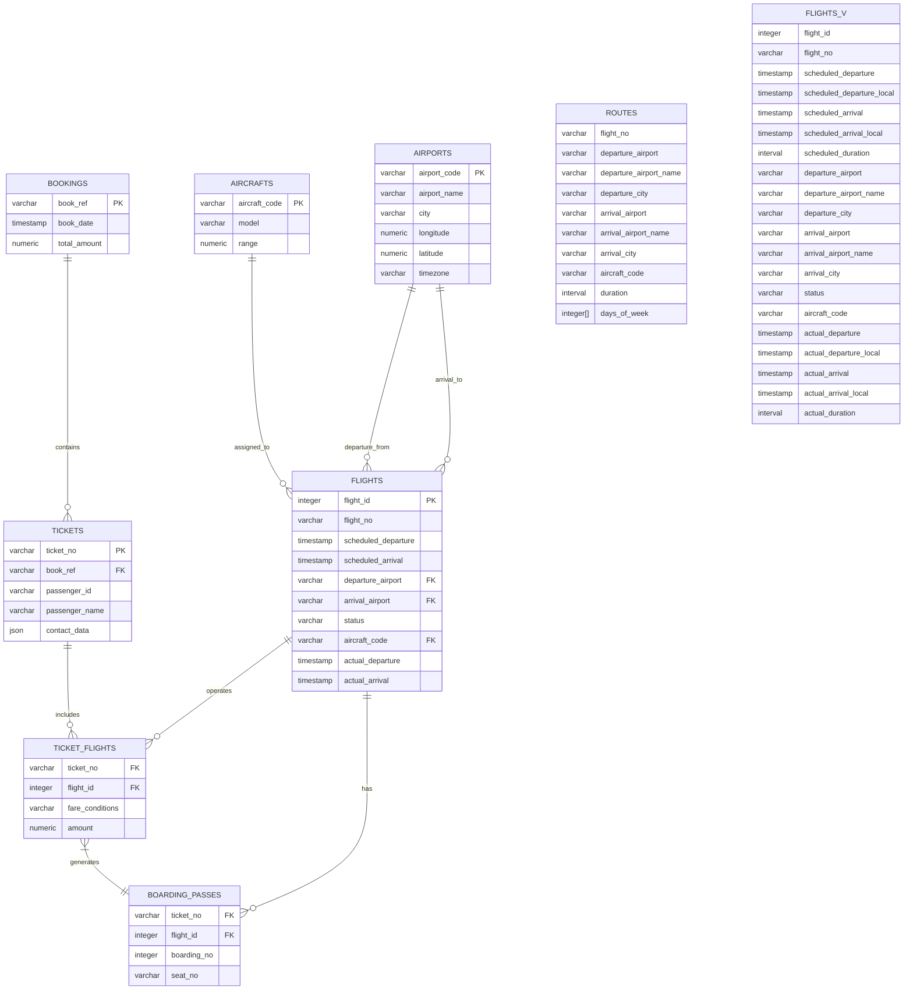

 &nbsp; 

# Aviation-transportation-SQL-analytics

_:airplane:  Этот репозиторий содержит решения практических кейсов по анализу данных в сфере авиаперевозок:_
  * Анализ воздушного флота: фильтрация и агрегация данных о самолетах;
  * Финансовые метрики: расчет динамики выручки, классификация маршрутов по доходности, поиск медиан стоимости и минимальной цены за км;
  * Операционная эффективность: анализ использования вместимости самолетов (накопительный итог пустых мест);
  * Статистика по маршрутам: определение популярности направлений через процентное соотношение и оконные функции;
  * CRM-аналитика: сегментация пассажиров на основе номеров телефонов.

_:toolbox:  Используемые технологии:_
  * Язык: SQL (ориентирован на PostgreSQL);
  * Ключевые концепции: оконные функции, агрегация данных, работа с подзапросами, функции для работы с датами и строками.

_:books: Исходные [данные](./data/avia.backup) и [описание](./data/bookings.pdf) базы данных Авиаперевозки._

_:card_file_box: Схема базы данных_

_:memo: SQL запросы с решениями и результатами:_

<table>
<tr>
    <th>Категория</th>
    <th>SQL Концепции</th> 
    <th>Задачи</th>
    <th>Ссылка на решение</th>
</tr>
<tr>
    <td rowspan="2">Анализ воздушного флота</td>
    <td rowspan="2">Объединить, группировать по, иметь, count(), array_agg(), массив, , @></td>
    <td>Выведите название самолетов, которые имеют менее 50 посадочных мест</td>
    <td> <a href="./queries/01_aircrafts_less_50_seats.md">📁 просмотреть</a></td>
</tr>
<tr>
    <td>Выведите названия самолетов не имеющих бизнес-класс...</td>
    <td> <a href="./queries/03_no_business_class_planes_array_agg.md">📁 просмотреть</a></td>
</tr> 
<tr>
    <td rowspan="4">Финансовые метрики флота</td>
    <td rowspan="4">Join, group by, having, count(), array_agg(), array, @>, date_trunc(), sum(), lag(), over(), round(), case when, подзапрос, with (cte), percentile_cont(), within group, кросс-соединение, create extension, min(), <@>, point()</td>
    <td>Выведите процентное изменение ежемесячной суммы бронирования билетов, округленной до сотых</td>
    <td>📁 <a href="./queries/02_percent_change_monthly_bookings.md">просмотреть</a></td>
</tr>
<tr>
    <td>Классифицируйте финансовые обороты по маршрутам: low/middle/high</td>
    <td>📁 <a href="./queries/07_route_revenue_classification.md">просмотреть</a></td>
</tr>
<tr>
    <td>Вычислите медиану стоимости перелетов, медиану размера бронирования и отношение медианы бронирования к медиане стоимости перелетов</td>
    <td>📁 <a href="./queries/08_median_flight_booking_ratio.md">просмотреть</a></td>
</tr>
<tr>
    <td>Найдите значение минимальной стоимости полета 1 км для пассажиров</td>
    <td>📁 <a href="./queries/09_min_flight_cost_per_km.md">просмотреть</a></td>
</tr>
 <tr>
    <td rowspan="1">Операционная эффективность</td>
    <td rowspan="1">With (cte), count(), over (partition by), left join, where, group by, sum(), over (partition by order by), join</td>
    <td>Вывести накопительный итог количества мест в самолетах по каждому аэропорту на каждый день...</td>
    <td>📁 <a href="./queries/04_cumulative_empty_seats_daily.md">просмотреть</a></td>
</tr>
 <tr>
    <td rowspan="1">Статистика по маршрутам</td>
    <td rowspan="1">Distinct, count() over (partition by), join, window functions, агрегатные функции с окнами</td>
    <td>Найдите процентное соотношение перелетов по маршрутам от общего количества перелетов. Решение через оконную функцию</td>
    <td>📁 <a href="./queries/05_route_flight_percentage.md">просмотреть</a></td>
</tr>
 <tr>
    <td rowspan="1">CRM-аналитика</td>
    <td rowspan="1">Подзапрос, ->> (извлечение json), substring(), group by, count()</td>
    <td>Выведите количество пассажиров по каждому коду сотового оператора</td>
    <td>📁 <a href="./queries/06_passengers_by_operator_code.md">просмотреть</a></td>
</tr>
</table>

[queries/](./queries/) - все SQL запросы с решениями 

 
